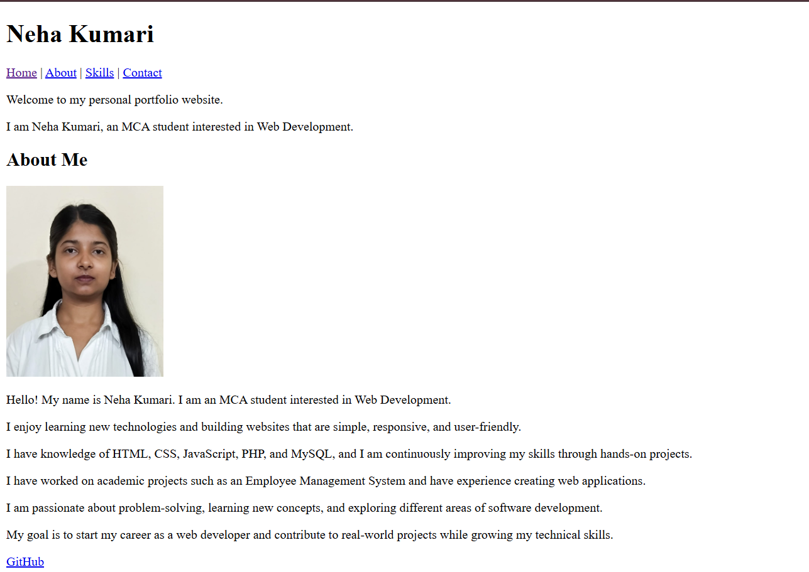

Personal Portfolio Website
Project Overview
This project is a Personal Portfolio Website created using HTML5 as part of the Developers Arena Internship Week 1 Task.
The main objective of this project is to learn the fundamentals of HTML and create a beginner-friendly portfolio webpage with multiple sections including Home, About, Skills, and Contact.

Objectives
•	Learn HTML5 structure
•	Understand semantic HTML tags
•	Create internal navigation links
•	Add images with alt text
•	Build a contact form with validation
•	Create a personal portfolio website

HTML Concepts Learned
HTML Structure
Learned how to create the basic structure of a webpage using:
•	html
•	head
•	body
•	title

Semantic HTML
Used semantic tags such as:
•	header
•	nav
•	main
•	section
•	footer
These tags help organize webpage content properly and improve readability.

Navigation Links
Used anchor tags (a) with section IDs to navigate between different sections of the webpage.

Images
Added a profile image using the img tag with proper alt text for accessibility.

Forms
Created a contact form using:
•	input
•	textarea
•	button
Also used validation attributes such as:
•	type="email"

Lists
Used unordered lists (ul, li) to display technical skills.

Portfolio Structure

Header
Contains:
•	Portfolio title
•	Navigation menu

Home Section
Contains:
•	Welcome message
•	Brief introduction

About Section
Contains:
•	Profile picture
•	Personal introduction
•	Educational background
•	Career interests

Skills Section
Displays technical skills using list tags.

Contact Section
Contains:
•	Name field
•	Email field
•	Message box
•	Submit button

Footer
Contains copyright information.

Technologies Used
•	HTML5

Setup Instructions
Requirements
•	Visual Studio Code
•	Web Browser (Chrome, Edge, Firefox, etc.)

Steps
1.	Download the project folder.
2.	Open the folder in VS Code.
3.	Open the index.html file.
4.	Run the file using a web browser or Live Server.
5.	Verify that all sections and navigation links are working properly.

Code Structure
The project follows a simple and organized file hierarchy:
portfolio-website
│
├── index.html
├── README.md
├── images
│   └── profile.jpg
└── screenshots

File Description
•	index.html – Main webpage containing all portfolio content.
•	README.md – Project documentation.
•	images/ – Stores images used in the website.
•	screenshots/ – Stores screenshots of the project.

Visual Documentation

Add screenshots demonstrating the functionality of the website:

•	Homepage

•	Navigation Menu

 
•	About Section

 

•	Skills Section

 

•	Contact Form

 

•	Footer Page

 

Technical Details
Website Architecture
The website follows a simple single-page architecture:

Header
↓
Navigation Menu
↓
Main Content
•	Home Section
•	About Section
•	Skills Section
•	Contact Section
↓
Footer

Algorithms and Data Structures
This project is a static HTML website and does not use any advanced algorithms or data structures.
The project focuses on:
•	Content organization
•	Semantic HTML structure
•	Navigation through anchor links
•	Form validation using HTML attributes

Conclusion

This project helped me understand the fundamentals of HTML and webpage structure. Through this project, I learned how to use semantic HTML tags, images, forms, navigation links, and sections to create a simple and organized portfolio website. It provided practical experience in building a structured webpage using HTML5.